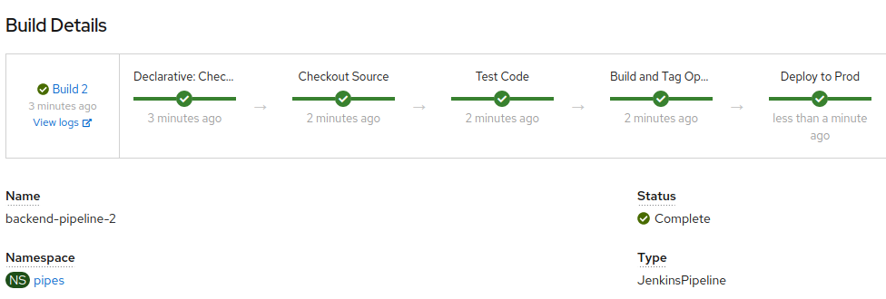

# Jenkins vs. Tekton Pipeliens Demo

## Jenkins Components

Steps for building the Jenkins Pipeline Components



```bash
export PROJECT="pipes"

bash ./create_jenkins.sh
```

## Pipelines (Tekton)

There are two Tekton pipelines offered by this applicaiton. One, which utilises a shared workspace and one that doesn't. This demonstrates both the benefit containers can provide to testing and the speed benefits of using workspaces. 

### Pipelines with Workspaces and Caching
The pipeline below only clones the repo once and pypi modules oncce. This is then used throughout the test and build processes to speed up deployments. The pipeline run **25%** quicker than the non-caching version.


Install the pipelines with workspaces:
```bash
export PROJECT="pipes"
cat ./tekton/pipeline-ws/*.yml | envsubst | oc apply -f -
```
### Pipelines with no caching
The pipeline below needs to clone and download the pypi modules 3 times, once for each pytest and again for the build. 


Install the pipelines without workspaces:
```bash 
export PROJECT="pipes"
cat ./tekton/pipeline-no-ws/*.yml | envsubst | oc apply -f -
```

## Application

```bash
export PROJECT="pipes"
export POSTGRESQL_DATABASE="quotes"
export POSTGRESQL_USER="user"
export POSTGRESQL_PASSWORD="`head /dev/urandom | tr -dc A-Za-z0-9 | head -c 13 ; echo ''`"
export external_imape_base_url="http://imagelookup.${PROJECT}.svc.cluster.local:8080"

cat ./app/manifests/backend/backend.yaml | envsubst | oc apply -f -

oc apply -f ./app/manifests/frontend
oc apply -f ./app/manifests/imagelookup

oc expose svc/frontend
```